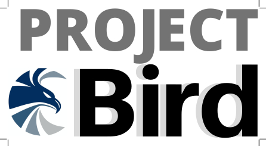

## Sobre a aplicação

Esta aplicação em C++ busca garantir uma rede privada virtual de comunicação entre o grupo de usuários logados. Uma vez logado no sistema, toda a comunicação enviada através da aplicação é criptografada usando uma chave RSA de tamanho definida pelo usuário. Este algoritmo serve como base para implementação de sistemas de comunicação seguros em outras aplicações, podendo ser facilmente integrado com outros sistemas escritos em C e C++.

## Configuração

Baixe a aplicação

    git clone https://github.com/Earqee/project-bird

Mova-se para a pasta ./main e crie a aplicação do servidor no computador desejado através de

    ./server <porta>

Agora, não necessariamente no mesmo computador, vá para o mesmo repositório e inicie a aplicação do cliente através de

    ./client <endereço ipv6 do servidor> <ip>

Por exemplo, `./client ::1 7002` e `./client 2804:14d:1283:8e7c:a947:38d6:f03d:9e48 7002` são entradas válidas.

#### Compilando

Primeiramente, instale as dependências [libc6-dev](https://packages.debian.org/search?keywords=libc6-dev), [gcc](https://packages.debian.org/search?keywords=gcc) e [g++](https://packages.debian.org/search?keywords=g%2B%2B) **ou** apenas instale o pacote build-essential.

    sudo apt-get install build-essential 

Para compilar o servidor, vá para a pasta ./main e compile usando [g++](https://packages.debian.org/search?keywords=g%2B%2B) com

    g++ -pthread applicationserver.cpp -o server

Para compilar o cliente, na mesma pasta do repositório, deve funcionar também

    g++ -pthread applicationclient.cpp -o client
    
    
## Recursos

### Diferenciais da aplicação

- **Do zero**: A única biblioteca usada é a oficial GNU C/C++, e apenas as funções mais recentes e comprovadamente seguras são utilizadas.
    > Usar qualquer material estrangeiro é difícil, mas oferece uma vantagem, pois garantimos que os dados não sejam interceptados por backdoors em outras bibliotecas. Isso também se torna uma vantagem quando percebemos que, ao contrário de muitas aplicações que seguem interfaces pré-estabelecidas por fontes externas, temos total domínio sobre o que acontece em nossa aplicação, pois tudo foi implementado do zero. Alguns dos problemas tratados por nosso manipulador de erros implementado do zero incluem, por exemplo, interrupção do sistema, bloqueio de threads, pacotes incompletos e desconexão repentina de usuários.
    >> Um ponto de partida para entender como fazemos isso é através da função TransmitData(..) na classe *Socket*.

- **Completa paralelismo**: O servidor lida com um número não definido de conexões e resolve consultas de clientes em paralelo.
    > Criando diferentes threads para receber conexões, autenticar usuários, responder perguntas ou realizar qualquer operação que possa impedir o servidor de responder, os usuários não precisam esperar que o servidor responda a outro usuário, pois para cada usuário o servidor aloca uma thread específica. Isso significa que um usuário pode pesquisar no banco de dados do servidor enquanto outro usuário autentica ou envia uma mensagem para outro usuário. Não há um comportamento predefinido e tudo é feito ao mesmo tempo.
    >> Um ponto de partida para entender como fazemos isso é através da função HandleUserRequest(..) na classe *ApplicationServer*.

- **Criptografia ponto a ponto**: Toda troca de dados entre os clientes e o servidor é criptografada.
    > Ataques do tipo homem-no-meio são mais comuns do que pensamos, e devemos nos preocupar mesmo com o tráfego que sai do nosso próprio computador, antes de atingir a camada de rede. Para isso, todos os dados são criptografados antes de atingir ou deixar a camada de rede, e a descriptografia só ocorre dentro de nossa aplicação, esteja os dados no cliente ou no servidor.
    >> Um ponto de partida para entender como fazemos isso é através da classe *Cripto*.

### Aplicações implementadas

- **Organizador**: mantenha-se atualizado sobre suas tarefas sem precisar compartilhá-las em plataformas não transparentes como o Trello.
    > Implementa o gerenciamento completo de listas de tarefas ao longo de meses ou semanas. 
    >> **Planos futuros**: implementar o gerenciamento semanal e mensal usando as estruturas de data e hora fornecidas pela biblioteca GNU C/C++, além de permitir a criação de grupos de desenvolvimento, juntamente com o gerenciamento de tarefas compartilhadas por esses grupos.
    
- **Mensageiro**: converse com quem quiser sem se preocupar em ter seu histórico de mensagens solicitado pelo governo.
    > Implementa um sistema simples para a troca de mensagens entre usuários autenticados.
    >> **Planos futuros**: implementar bate-papos em grupo de usuários e envio de arquivos.

## Protocolos

Foram desenvolvidos protocolos para a troca de mensagens entre o usuário e o servidor. Como o servidor sempre mantém em qual aplicação o cliente está, garantimos que protocolos com assinaturas semelhantes não implicam em comportamento indesejado.

A tabela abaixo ilustra o comportamento da aplicação organizadora. O cliente envia uma solicitação ao servidor (coluna central) e o servidor responde com uma resposta apropriada (coluna à direita). Por padrão, definimos que se ocorrerem erros, retornamos a resposta *ERROR* para tratamento.
ela abaixo ilustra o comportamento da aplicação organizadora. O cliente envia uma solicitação ao servidor (coluna central) e o servidor responde com uma resposta apropriada (coluna à direita). Por padrão, definimos que se ocorrerem erros, retornamos a resposta *ERROR* para tratamento.

| Descrição | (primeiramente) Cliente envia | (em segundo lugar) Resposta do servidor |
| --- | --- | --- | 
| Adicionar tarefa ao dia | `ADD <dia> <título>` | `SUCCESS` | 
| Excluir i-ésima tarefa do dia | `DEL <dia> <índice>` | `SUCCESS` | 
| Editar i-ésima tarefa do dia para título | `EDIT <dia> <índice> <título>` | `SUCCESS` | 
| Obter todas as tarefas do dia | `DAY <dia>` | sequência formatada de `<título>` | 
| Obter todas as tarefas da semana | `WEEK` | sequência formatada de `<dia> <título>` | 
| Sair do menu organizador | `QUIT` | *sem resposta* | 

Abaixo está a tabela que ilustra o comportamento da aplicação de mensagens.

| Descrição | (primeiramente) Cliente envia | (em segundo lugar) Resposta do servidor |
| --- | --- | --- | 
| Tornar-se disponível para conversar |  `ENROLL` | `SUCCESS` | 
| Obter usuários disponíveis para conversar | `USERS` | sequência formatada de `<login> <id>` | 
| Obter mensagens do usuário com o ID fornecido | `FROM <id>` | sequência formatada de `<mensagem>` | 
| Enviar mensagem para o usuário com o ID fornecido | `SEND <id> <mensagem>` | `SUCCESS` | 
| Sair do menu do mensageiro | `QUIT` | *sem resposta* | 

Existe também a possibilidade de um cliente fechar sutilmente a aplicação de tal maneira que não haja janela para enviar uma mensagem `QUIT` para o servidor. Nesse caso, usamos o fato de que a próxima transmissão/recepção de soquete falha e procedemos de acordo para atribuir um status de `DISCONNECTED` ao usuário, o que implica na remoção do usuário de todas as estruturas de dados alocadas pelo servidor.
 (https://github.com/Earqee/project-bird/blob/master/LICENSE)

## Agradecimentos

Este projeto foi desenvolvido e revisado pelos discentes de Engenharia de Computação Thiago José e João Arthur, com revisão final pelo Prof. Dr. Leandro Dias.
